<div align="center">
  
</div>

<br/>

<p align="center">
  <a href="https://naveed-gung.dev" target="_blank">
    
  </a>&nbsp;
  <a href="https://www.linkedin.com/in/naveed-sohail-gung-285645310" target="_blank">
    
  </a>&nbsp;
  <a href="mailto:naveedsohailg@gmail.com">
    
  </a>
</p>

<br/>

---

<br/>

<div align="center">
  
</div>

<br/>

### `> whoami`

Software engineer who builds things end-to-end — from REST APIs and database schemas to pixel-level UI polish, real-time 3D web experiences, and production-deployed mobile apps. MIS student by day, pulling late nights shipping actual products that work in the real world.

I don't specialize in one layer. I own the full stack: **design system → component library → API layer → data model → deployment pipeline → monitoring**.

<table>
<tr>
<td width="25%" align="center" valign="top">
<br/>
Engineering <b>full-stack web & mobile</b> products end-to-end
</td>
<td width="25%" align="center" valign="top">
<br/>
Architecting <b>scalable REST / real-time APIs</b> with Node.js & GraphQL
</td>
<td width="25%" align="center" valign="top">
<br/>
Crafting <b>immersive 3D web experiences</b> with Three.js & Blender
</td>
<td width="25%" align="center" valign="top">
<br/>
Building <b>AI-powered products</b> — voice, vision, and intelligent UX
</td>
</tr>
<tr>
<td width="25%" align="center" valign="top">
<br/>
Designing <b>security-first systems</b> — threat detection & forensics
</td>
<td width="25%" align="center" valign="top">
<br/>
Shipping <b>cross-platform mobile apps</b> with React Native & Flutter
</td>
<td width="25%" align="center" valign="top">
<br/>
Engineering <b>enterprise ERP & multi-tenant</b> platforms with ABP & C#
</td>
<td width="25%" align="center" valign="top">
<br/>
Automating <b>deployments & CI/CD pipelines</b> with Docker & GitHub Actions
</td>
</tr>
</table>

<br/>

---

### `> tech-stack --full`

<div align="center">

**— Languages —**


**— Frontend —**


**— Backend & APIs —**


**— Mobile —**


**— Databases —**


**— DevOps & Cloud —**


</div>

<br/>

---

### `> ls -la ./projects`

<br/>

####  &nbsp;Flagship Builds

<table>
<tr>
<td width="50%" align="center" valign="top">


#### [ZERO-DAY-GUARDIAN](https://github.com/naveed-gung/ZERO-DAY-GUARDIAN)

Real-time **container threat detection** engine with automated defense response and forensic evidence collection. eBPF-powered kernel instrumentation, Kubernetes operator, and incident timeline reconstruction.

`Java` `Go` `Rust` `Spring Boot` `eBPF` `Kubebuilder`

</td>
<td width="50%" align="center" valign="top">


#### [S.T.A.R — Threat & Anomaly Radar](https://github.com/naveed-gung/S.T.A.R---System-Threat---Anomaly-Radar)

Kernel-integrated **cross-platform threat detection** targeting rootkits, memory anomalies, and process injection — with a WebGL-powered real-time dashboard.

`C` `Electron` `WebGL` `SQLite` `CMake` `WDM`

</td>
</tr>
<tr>
<td width="50%" align="center" valign="top">


#### [Jenny — 3D AI Avatar Chat](https://github.com/naveed-gung/jenny)

Full-stack AI chat platform with a **real-time 3D avatar**, lip-synced TTS, and Blender-authored character model. WebSocket-driven, MERN backend.

`React` `Three.js` `Node.js` `MongoDB` `Blender` `WebSocket`

</td>
<td width="50%" align="center" valign="top">


#### [Elite Showroom](https://github.com/naveed-gung/Elite-Showroom)

Cinematic **luxury car configurator** — Blender-authored models, glassmorphic UI, spatial audio, per-country inventory, interior/exterior exploration mode.

`React` `Three.js` `React Three Fiber` `Zustand` `Tailwind` `Blender`

</td>
</tr>
</table>

<br/>

####  &nbsp;Full-Stack Products

<table>
<tr>
<td width="50%" align="center" valign="top">


#### [Bazaar](https://github.com/naveed-gung/bazaar)

AI-powered **e-commerce platform** — intelligent product recommendations, secure checkout flow, real-time inventory management, and admin analytics dashboard.

`React` `Node.js` `Express` `MongoDB` `JWT` `Stripe`

</td>
<td width="50%" align="center" valign="top">


#### [EduFlow](https://github.com/naveed-gung/eduflow)

Production **e-learning platform** with course management, video streaming pipeline, quiz assessments, certificates, and real-time learner progress tracking.

`MongoDB` `Express` `React` `Node.js` `JWT` `Cloudinary`

</td>
</tr>
<tr>
<td width="50%" align="center" valign="top">


#### [Nova — AI Voice Assistant](https://github.com/naveed-gung/nova)

**Multilingual voice AI** supporting English, Arabic & French with browser-native speech recognition, context-aware replies, and conversational memory.

`React` `TypeScript` `Tailwind CSS` `Web Speech API`

</td>
<td width="50%" align="center" valign="top">


#### [Auto-Server-Script](https://github.com/naveed-gung/Auto-Server-Script)

One-command **MERN infrastructure provisioner** — zero human intervention from bare VPS to SSL-terminated, PM2-managed, Dockerized production stack.

`Shell` `Docker` `Node.js` `MongoDB` `PM2` `Certbot`

</td>
</tr>
</table>

<br/>

####  &nbsp;Mobile Apps

<table>
<tr>
<td width="50%" align="center" valign="top">


#### [AR-SEC](https://github.com/naveed-gung/AR-SEC)

Mobile **security assessment toolkit** using Augmented Reality overlays for physical and network threat evaluation with real-time intelligence feeds.

`React Native` `TypeScript` `ARKit` `ARCore`

</td>
<td width="50%" align="center" valign="top">


#### [EmotionSense](https://github.com/naveed-gung/EmotionSense)

Privacy-first **on-device emotion detection** — real-time facial analysis, age & gender inference, fully offline with TensorFlow Lite and ML Kit.

`Flutter` `Dart` `TensorFlow Lite` `Google ML Kit`

</td>
</tr>
<tr>
<td width="50%" align="center" valign="top">


#### [Monolith](https://github.com/naveed-gung/monolith)

Offline-first **music player** — local library management, smart auto-curated playlists, synced lyrics, equalizer, and full lock-screen / media-notification integration on Android & iOS.

`Flutter` `Dart` `just_audio` `audio_session` `Offline-First`

</td>
<td width="50%" align="center" valign="top">
</td>
</tr>
</table>

<p align="center"><i>→ <a href="https://github.com/naveed-gung?tab=repositories">Browse all repositories</a> · <a href="https://naveed-gung.dev">naveed-gung.dev</a></i></p>

<br/>

---

### `> git log --stats`

<div align="center">
  
</div>

<br/>

---

### `> cat ./experience.log`

```
[2025.11 → Present]  Auvia Groups — Full-Stack & Mobile Engineer (Contract)
                     ├── Continued on contract following the internship
                     ├── Angular + .NET enterprise features & Odoo 19 ERP work
                     ├── AI integrations, infrastructure & deployment automation
                     └── Shipping production features across web, mobile & ERP

[2025.08 → 2025.11]  Auvia Groups — Full-Stack & Mobile Engineer
                     ├── Blazor + C# + ABP Framework enterprise modules
                     ├── Odoo ERP customization & business process automation
                     ├── Cybersecurity R&D & AI tooling integration
                     └── Owned full feature lifecycle: spec → deploy → monitor

[2024 → Present]     Freelance Full-Stack Development
                     ├── PWR Store — React + Tailwind, mobile-first storefront
                     ├── WhatsApp-integrated checkout pipeline
                     └── Performance-optimized, client-shipped production builds

[Continuous]         Independent Project Engineering
                     ├── Security tools: ZERO-DAY-GUARDIAN, E.MAT, S.T.A.R
                     ├── 3D/WebGL: Jenny, Elite Showroom
                     └── Full-stack platforms: Bazaar, EduFlow, Nova
```

<br/>

---

### `> certifications --list`

<table>
<tr>
<td width="33%" align="center" valign="top">


**FreeCodeCamp**<br/>JavaScript Algorithms & Data Structures · Responsive Web Design

</td>
<td width="33%" align="center" valign="top">


**FreeCodeCamp**<br/>Python & C# Certifications

</td>
<td width="33%" align="center" valign="top">


**Cisco Networking Academy**<br/>Cybersecurity Fundamentals · Emerging Tech

</td>
</tr>
<tr>
<td width="33%" align="center" valign="top">


**Johns Hopkins / Coursera**<br/>Full-Stack Web Development

</td>
<td width="33%" align="center" valign="top">


**AWS**<br/>Essentials, Fargate, Containers, Billing & Cost Management

</td>
<td width="33%" align="center" valign="top">


**Anthropic**<br/>Claude Code in Action · Introduction to Agent Skills · Introduction to Subagents

</td>
</tr>
</table>

<br/>

---

### `> ./connect.sh`

<div align="center">
  <a href="https://naveed-gung.dev" target="_blank">
    
  </a>&nbsp;
  <a href="https://www.linkedin.com/in/naveed-sohail-gung-285645310" target="_blank">
    
  </a>&nbsp;
  <a href="https://www.instagram.com/naveed._.gung" target="_blank">
    
  </a>&nbsp;
  <a href="mailto:naveedsohailg@gmail.com">
    
  </a>
</div>

<br/>

<div align="center">
  
</div>
